# Diagrama Entidad-Relación (DER)

## E-commerce 3D Print - Base de Datos PostgreSQL

### Resumen de Entidades

- **19 entidades principales**
- **Relaciones definidas por claves foráneas**
- **Índices optimizados para consultas frecuentes**

---

## Diagrama DER (Mermaid)

```mermaid
erDiagram
    USER ||--o{ ADDRESS : "tiene"
    USER ||--o{ ORDER : "realiza"
    USER ||--o{ PAYMENT : "realiza"
    USER ||--o{ REVIEW : "escribe"
    USER ||--o{ SESSION : "mantiene"
    USER ||--o{ INVENTORY_MOVEMENT : "registra"
    USER ||--o{ ALERT : "resuelve"
    USER ||--o{ CART : "posee"
    USER ||--o{ ORDER_MESSAGE : "envía"

    CATEGORY ||--o{ PRODUCT : "contiene"

    PRODUCT ||--o{ PRODUCT_IMAGE : "tiene"
    PRODUCT ||--o{ CART_ITEM : "en"
    PRODUCT ||--o{ ORDER_ITEM : "en"
    PRODUCT ||--o{ INVENTORY_MOVEMENT : "afecta"
    PRODUCT ||--o{ ALERT : "genera"
    PRODUCT ||--o{ REVIEW : "recibe"

    CART ||--o{ CART_ITEM : "contiene"
    CART ||--|| ADDRESS : "envío_a"

    ORDER ||--o{ ORDER_ITEM : "contiene"
    ORDER ||--o{ ORDER_MESSAGE : "tiene"
    ORDER ||--|| INVOICE : "genera"
    ORDER ||--o{ INVENTORY_MOVEMENT : "afecta"
    ORDER ||--|| PAYMENT : "tiene"
    ORDER ||--o{ ALERT : "genera"
    ORDER ||--|| ADDRESS : "envío_a"

    ADDRESS ||--o{ ORDER : "destino"
    ADDRESS ||--o{ CART : "guarda"

    SHIPPING_CONFIG ||--o{ ORDER : "configura"

    COUPON ||--o{ ORDER : "aplica"

    FAQ }o--o{ FAQ : "categoría"

    SITE_CONFIG ||--o{ SITE_CONFIG : "singleton"

    WEBHOOK_EVENT ||--o{ WEBHOOK_EVENT : "cola"

    EVENT_STORE ||--o{ EVENT_STORE : "stream"

    USER {
        string id PK
        string email UK
        string password
        string name
        string phone
        enum role "CUSTOMER|ADMIN"
        string taxId
        boolean isActive
        int failedAttempts
        datetime lockedUntil
        datetime createdAt
    }

    CATEGORY {
        string id PK
        string name
        string slug UK
        string description
        string image
        int displayOrder
        boolean isActive
    }

    PRODUCT {
        string id PK
        string slug UK
        string name
        string description
        string shortDescription
        decimal price
        int stock
        string categoryId FK
        enum material "PLA|PETG"
        float widthCm
        float heightCm
        float depthCm
        boolean isActive
        boolean isFeatured
    }

    PRODUCT_IMAGE {
        string id PK
        string productId FK
        string url
        boolean isMain
        int displayOrder
    }

    CART {
        string id PK
        string userId FK
        string shippingAddressId FK
        decimal subtotal
    }

    CART_ITEM {
        string id PK
        string cartId FK
        string productId FK
        int quantity
        decimal unitPrice
    }

    ORDER {
        string id PK
        string orderNumber UK
        string userId FK
        enum status "PENDING|CONFIRMED|PREPARING|SHIPPED|DELIVERED|CANCELLED"
        decimal total
        string shippingAddressId FK
        enum paymentMethod "CARD|PAYPAL|BIZUM|TRANSFER"
        datetime shippedAt
        string trackingNumber
        string carrier
    }

    ORDER_ITEM {
        string id PK
        string orderId FK
        string productId FK
        string name
        decimal price
        int quantity
        decimal subtotal
    }

    PAYMENT {
        string id PK
        string orderId FK
        string userId FK
        decimal amount
        enum method "CARD|PAYPAL|BIZUM|TRANSFER"
        enum status "PENDING|COMPLETED|FAILED|REFUNDED"
        string stripeSessionId UK
    }

    INVOICE {
        string id PK
        string orderId FK
        string invoiceNumber UK
        string companyName
        string companyTaxId
        string clientName
        string clientTaxId
        decimal total
        datetime issuedAt
    }

    ADDRESS {
        string id PK
        string userId FK
        string name
        string recipient
        string address
        string city
        string postalCode
        string province
        boolean isDefault
    }

    REVIEW {
        string id PK
        string productId FK
        string userId FK
        int rating
        string title
        string comment
        boolean isVerified
        boolean isApproved
    }

    INVENTORY_MOVEMENT {
        string id PK
        string productId FK
        string orderId FK
        enum type "IN|OUT|ADJUSTMENT|RETURN"
        int quantity
        int previousStock
        int newStock
        string createdBy FK
    }

    ALERT {
        string id PK
        enum type "LOW_STOCK|OUT_OF_STOCK|ORDER_DELAYED"
        enum severity "LOW|MEDIUM|HIGH|CRITICAL"
        string title
        string productId FK
        string orderId FK
        enum status "PENDING|RESOLVED|IGNORED"
        string resolvedBy FK
    }

    SHIPPING_CONFIG {
        string id PK
        string name
        decimal price
        decimal freeShippingFrom
        int minDays
        int maxDays
        boolean isActive
    }

    COUPON {
        string id PK
        string code UK
        enum type "PERCENTAGE|FIXED|FREE_SHIPPING"
        decimal value
        int maxUses
        int usedCount
        datetime validFrom
        datetime validUntil
    }

    FAQ {
        string id PK
        string question
        string answer
        string category
        int displayOrder
        boolean isActive
    }

    SITE_CONFIG {
        string id PK
        string companyName
        string companyTaxId
        string companyEmail
        string companyPhone
        string companyAddress
        boolean maintenanceMode
    }

    EVENT_STORE {
        string id PK
        string aggregateId
        string aggregateType
        string eventType
        json eventData
        int version
        datetime createdAt
    }

    WEBHOOK_EVENT {
        string id PK
        string eventType
        json payload
        enum provider "STRIPE|PAYPAL"
        string stripeSignature
        int attempts
        boolean processed
    }
```

---

## Resumen de Relaciones

| Entidad Padre | Entidad Hija      | Tipo | Descripción                                           |
| ------------- | ----------------- | ---- | ----------------------------------------------------- |
| User          | Address           | 1:N  | Un usuario puede tener múltiples direcciones          |
| User          | Order             | 1:N  | Un usuario puede realizar múltiples pedidos           |
| User          | Cart              | 1:1  | Un usuario tiene un carrito único                     |
| User          | Review            | 1:N  | Un usuario puede escribir múltiples reseñas           |
| Category      | Product           | 1:N  | Una categoría contiene múltiples productos            |
| Product       | ProductImage      | 1:N  | Un producto tiene múltiples imágenes                  |
| Product       | Review            | 1:N  | Un producto recibe múltiples reseñas                  |
| Cart          | CartItem          | 1:N  | Un carrito contiene múltiples items                   |
| Order         | OrderItem         | 1:N  | Un pedido contiene múltiples items                    |
| Order         | Payment           | 1:1  | Un pedido tiene un único pago                         |
| Order         | Invoice           | 1:1  | Un pedido genera una única factura                    |
| Order         | OrderMessage      | 1:N  | Un pedido tiene múltiples mensajes                    |
| Product       | InventoryMovement | 1:N  | Un producto tiene múltiples movimientos de inventario |
| User          | InventoryMovement | 1:N  | Un usuario registra múltiples movimientos             |

---

## Índices Principales

| Tabla               | Columna(s)  | Tipo   | Propósito                |
| ------------------- | ----------- | ------ | ------------------------ |
| users               | email       | UNIQUE | Búsqueda por email       |
| users               | role        | INDEX  | Filtrado por rol         |
| products            | slug        | UNIQUE | Búsqueda SEO friendly    |
| products            | categoryId  | INDEX  | Filtrado por categoría   |
| orders              | userId      | INDEX  | Pedidos por usuario      |
| orders              | status      | INDEX  | Filtrado por estado      |
| orders              | orderNumber | UNIQUE | Búsqueda por número      |
| payments            | orderId     | UNIQUE | Un pago por pedido       |
| inventory_movements | productId   | INDEX  | Movimientos por producto |

---

## Generado desde Prisma Schema

- **Fecha**: Abril 2025
- **Herramienta**: Prisma ORM
- **Base de datos**: PostgreSQL 15+
